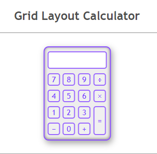

# Calculator Project

## Overview
This is a simple calculator project built using HTML, CSS, and JavaScript. It utilizes the grid layout for a clean and organized user interface.

## Preview

## Features
- Basic arithmetic operations (addition, subtraction, multiplication, division)
- Responsive design using CSS grid layout
- Clear and concise JavaScript code for functionality

## Usage
1. Clone the repository to your local machine.
2. Open `index.html` in your preferred web browser.
3. Start performing calculations!

Feel free to explore the code and make any improvements or modifications as needed.

## Credits
- Abdullah Ansari

Happy coding!
